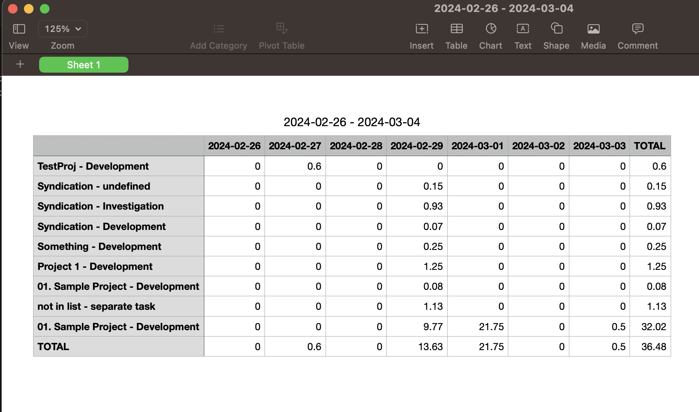

# VSCode Time Keeper

This is a Visual Studio Code extension that allows you to track your time across projects and generate weekly timesheet reports.

## Features

1. Start tracking time for a project


2. Stop tracking time for a project


3. Manually edit a daily time log


4. Generate a weekly report


## Requirements

You should have a system application for viewing CSV files.  The link for the report will just open the CSV on your system.

## Extension Settings

This extension contributes the following settings:

* `TimeKeeper.ProjectTasks`: A dictionary containing a project name as a key and a comma separated list of possible tasks as a value.  Keys should be numbered, with the most used ones on top, since they will appear in alphabetical order and default to the first one.
* `TimeKeeper.TimeInterval`: The granularity to use for times.  All times entered will round to the nearest interval.
* `TimeKeeper.AddNotes`: When enabled, there is an additional text prompt when starting a task that adds notes.
Notes are not used when compiling the reports, but are there in the raw files for reference.

## Release Notes

### 1.0.0

Initial release of VSCode Time Keeper

* Contains commands to start/stop tasks
* Contains a command to generate a weekly report (timesheet).
* Contains options to define projects/tasks, custom note support, and the ability to change the granularity of times to allow.

### 1.0.1

Add `Edit Time Log` function to open a daily time log for manual editing.

### 1.0.2

Add tests and minor defect fixes.

### 1.0.3

Start/stop usability enhancements
  - Use more subtle status bar messaging.
      - No link to open file, because there's a task for it.
  - No link to open CSV, just opens externally automatically.
  - Always add 24:00 as an option on time pickers.
  - Show previous line in title when starting a task.

---

## Contributing

Please feel free to fork this project and submit pull requests to the repository.

### Install with npm

```bash
npm install
```

### Build your feature/bug fix

Build your feature.  All commands are defined in package.json and registered extensions.ts.

### Submit a pull request

Submit a request to master on the main project, and I'll take a look at it.